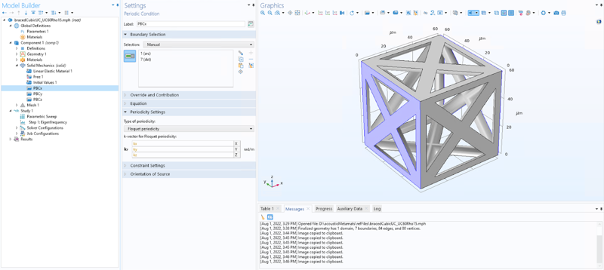
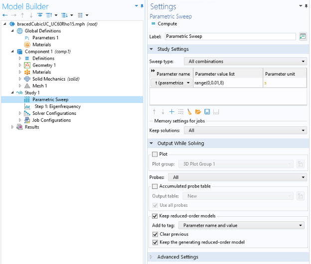

# Bloch Wave Analysis
This is a step by step guide on how to set up Bloch wave analysis on a single representative volume element (RVE) in COMSOL Multiphysics. Follow along with the following files:
- On Euclid: 
  - "D:\acousticMetamats\refFiles\bracedCubicUC_UC60Rho15.mph" (for simulation setup only) 
  - "D:\acousticMetamats\refFiles\bracedCubicUC_UC60Rho15_withSol.mph" (for simulation setup and results analysis) 
## Parameters 
Important parameters include: 
- Geometrical: (for easy parameterization) 
  - Unit Cell Size 
- Strut radius: dictates relative density 
- K vectors for Floquet Periodic Boundary Conditions: 
  - This covers the Brillouin zone of your RVE 
  - b1, b2, b3: 2*pi/(UCSize)
  - Example for cubic lattice Brillouin zone
    - kx = if(t<1, 0.5*t*b1, if(t<2, 0.5*b1, if(t<3, (1.5-0.5*t)*b1, if(t<4, 0.5*(t-3)*b1, if(t<5, 0.5*b1, if(t<6,0.5*b1, if(t<7,0.5*b1, if(t<8.1,(0.5-0.5*(t-7))*b1,0))))))))
    - ky = if(t<1, 0, if(t<2, -0.5*(t-1)*b2, if(t<3, (-1.5+0.5*t)*b2, if(t<4, 0.5*(3-t)*b2, if(t<5, -0.5*b2, if(t<6,((t-5)*0.5-0.5)*b2, if(t<7,-0.5*(t-6)*b2, if(t<8.1,(0.5*(t-7)-0.5)*b2,0))))))))
    - kz = if(t<1, 0, if(t<2, 0, if(t<3, 0, if(t<4, 0.5*(t-3)*b3, if(t<5, (0.5-0.5*(t-4))*b3, if(t<6, 0, if(t<7, 0.5*(t-6)*b3, if(t<8.1, (0.5-0.5*(t-7))*b3, 0))))))))
- Parameterization Variable (defined as “t”): this is the driving variable in your Parametric Study as it will sweep across all wavevectors in the Brillouin zone for your geometry. 

## Geometry
Set up a geometry such that there are uniform (selectable) faces on each side of the unit cell that are identical to their opposite sides. This allows you to easily select faces for Solid Mechanics boundary conditions in the next step. See below for an example of general workflow and geometry commands. 

## Materials 
Define a material as desired. Make sure all geometric domains have a material assigned to them and that Young’s Modulus, Poisson’s Ratio, and density are all defined. 

## Solid Mechanics 
Define the following conditions: 
Linear Elastic Material (should be pre-defined): assign to your RVE domain
Free (should be pre-defined): select all, as later boundary conditions will override this condition 
Initial Values: select your RVE domain and set all displacements and velocities to 0 
Periodic Boundary Conditions (“Connections” -> “Periodic Condition”, define 3 – one for each direction): Select faces directly opposite from each other as a source and destination (COMSOL will pre-define these as source and destination). Change “Type of Periodicity” to “Floquet Periodicity” and set x, y, and z components of the k vector as parameters kx, ky, kz from above (in “Parameters” section). See image below for an example.  

## Mesh
Time to create your mesh! A couple of points here: 
Set the mesh size such that each element is spanned by at least 3 mesh elements (COMSOL may have issues solving with anything less defined). 
Implementing the Periodic Condition in COMSOL Solid Mechanics will automatically define a mesh with “Free Triangular” and “Copy Face” for each source and destination of your boundary conditions (see image below). 
Be careful not to make your mesh too fine as this will drastically increase computation time. 

## Study
Make sure the following are defined under the “Study” node: 
- Step 1: Eigenfrequency: Set desired number of eigenfrequencies to whatever you want. Increasing this number will increase computation time as it increases the number of eigenfrequencies to find at each wavevector point. 

- Parametric Sweep: set your parameterization variable to sweep across the desired portion of the Brillouin zone for your geometry. Increasing the step size (0.01 in this case) lowers computation time as this lessens the number of wavevector points at which to find eigenfrequencies. See image below for example on how to define this. 

After these are defined, either hit compute or set up a batch job to run. If you would like to parameterize another variable (i.e., strut radius, unit cell size) to get eigenfrequencies for multiple types of RVEs, add a parameter using the plus symbol in the “Study Settings” dropdown of the Parametric Sweep Settings window. 

## Analyzing Solutions
Please follow along on "D:\acousticMetamats\refFiles\bracedCubicUC_UC60Rho15_withSol.mph". 

### Plot a Dispersion Relation in COMSOL 
1. Right click on “Derived Values” and select “Global Evaluation” 
2. Type “real(freq)” into the expressions table and make sure your data set is the “Parametric Solutions” dataset. Then click “Evaluate”.
   - If it looks like part of the dataset is missing, go to: Table 1 Settings -> Storage -> Maximum Number of Rows. Increase the number of rows to something that will accommodate the full data set. 
3. Right click “Results” then “1D Plot Group”. Right Click “1D Plot Group”, then “Table Graph”. 
4. Select “t(s)” under “x-axis data” and “real(freq) (Hz)” under “Plot columns -> manual”. 
5. Under Coloring and Style, select “None” under “Line” and “Point” under “Marker”. Make sure to select “in data points” under “Positioning” as well. Click “Plot”. 

### Plot a Dispersion Relation in Matlab  
1. Right click on “Derived Values” and select “Global Evaluation” 
2. Type “real(freq)” into the expressions table and make sure your data set is the “Parametric Solutions” dataset. Then click “Evaluate”.
    - If it looks like part of the dataset is missing, go to: Table 1 Settings -> Storage -> Maximum Number of Rows. Increase the number of rows to something that will accommodate the full data set. 
3. Export this table by either clicking “Export” then selecting the file type of your choice (the following data analysis scripts are tailored to csv files) or by clicking “Copy Table and Headers to Clipboard'' then pasting in an excel file and saving as a csv or xslx file. (See image below to locate these icons) 
4. In Matlab, import csv data with the “dlmread” command and scatter plot column 1 (t(s)) on x axis and column 3 (real(freq) (Hz)) on y axis 

